# Centurion DG Platform - Architecture Documentation

This document provides a comprehensive overview of the Centurion DG Platform architecture, including component relationships, data flow, and system design patterns.

---

## Table of Contents

1. [High-Level Architecture](#high-level-architecture)
2. [Application Layer Structure](#application-layer-structure)
3. [Data Flow Architecture](#data-flow-architecture)
4. [Module Dependencies](#module-dependencies)
5. [Storage Architecture](#storage-architecture)
6. [Component Hierarchy](#component-hierarchy)
7. [Routing Structure](#routing-structure)
8. [AI Integration Architecture](#ai-integration-architecture)

---

## High-Level Architecture

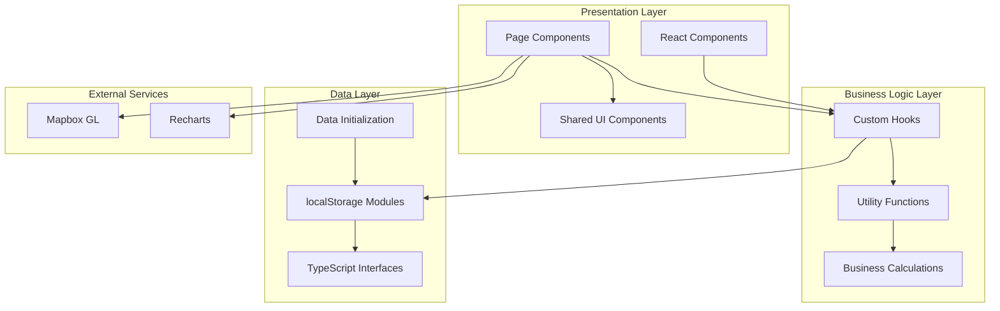

---

## Application Layer Structure

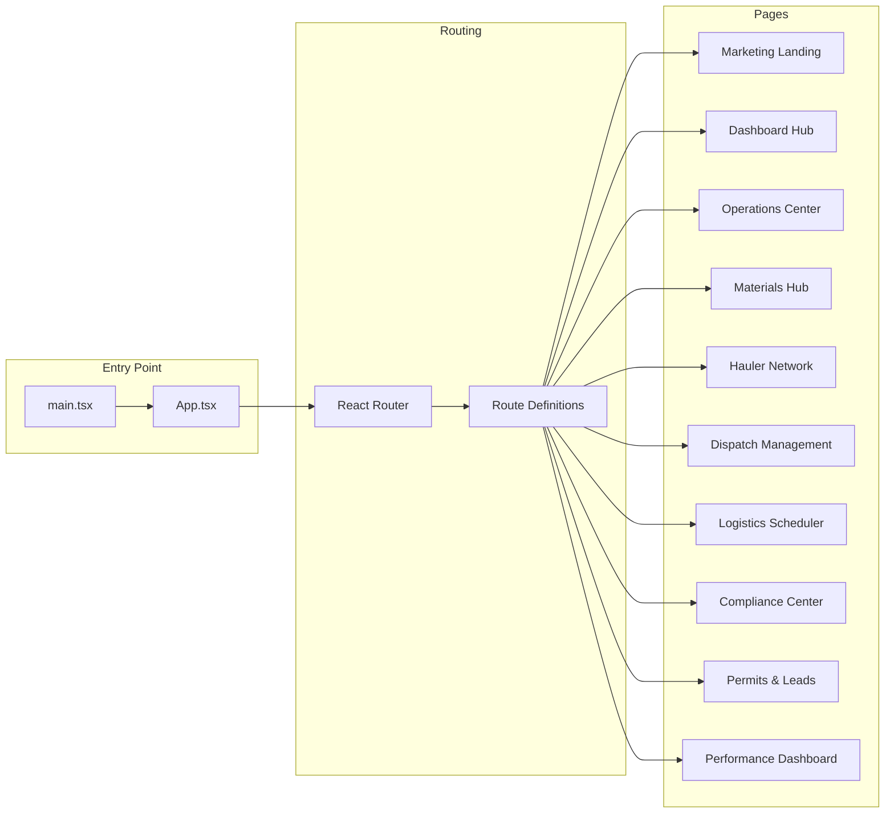

---

## Data Flow Architecture

### Core Data Flow Pattern

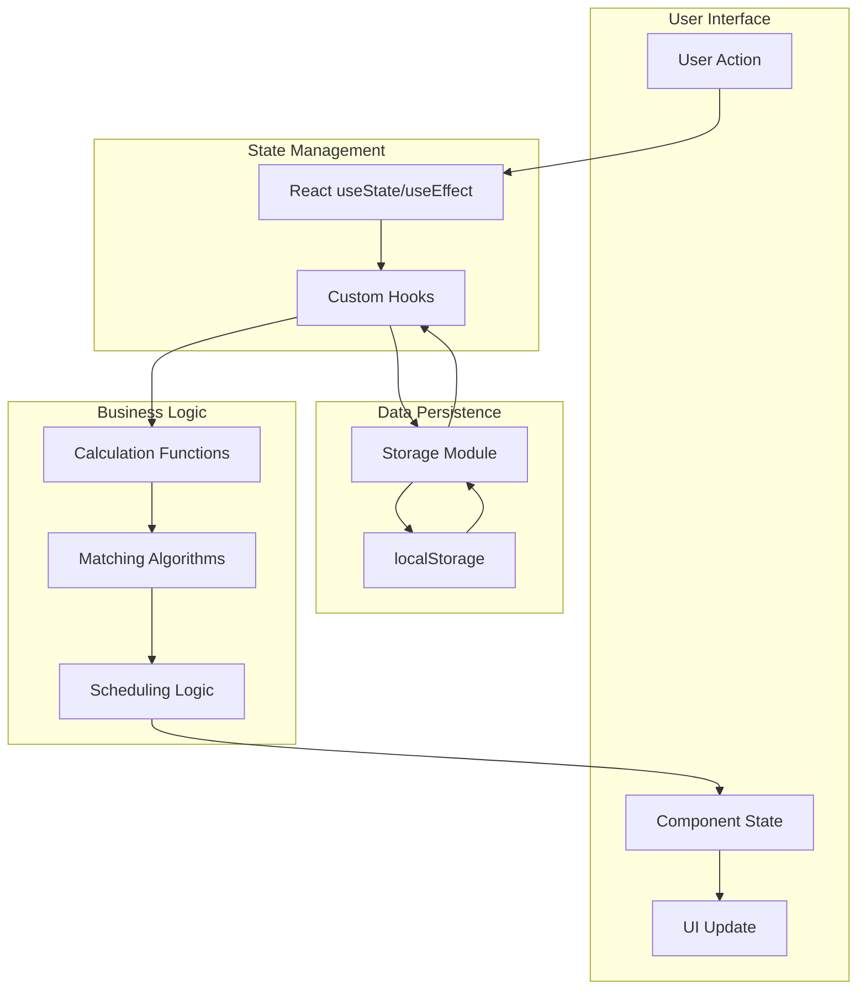

### Permits to Jobs Conversion Flow

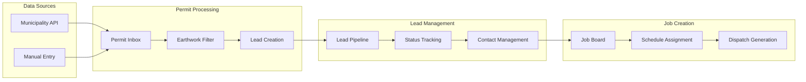

---

## Module Dependencies

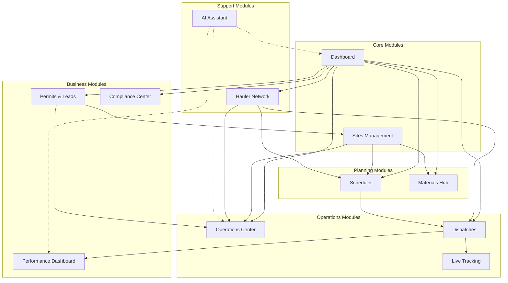

---

## Storage Architecture

```mermaid
graph TB
    subgraph "Storage Modules"
        A[storage.ts]
        B[schedulerStorage.ts]
        C[dispatchStorage.ts]
        D[operationsStorage.ts]
        E[complianceStorage.ts]
        F[leadStorage.ts]
        G[geotechnicalStorage.ts]
        H[municipalityStorage.ts]
    end
    
    subgraph "localStorage Keys"
        A1[centurion_sites]
        A2[centurion_matches]
        B1[centurion_haulers]
        B2[centurion_schedules]
        C1[centurion_drivers]
        C2[centurion_dispatch_tickets]
        D1[centurion_jobs]
        D2[centurion_alerts]
        D3[centurion_messages]
        D4[centurion_shift_reports]
        E1[centurion_compliance_documents]
        E2[centurion_compliance_alerts]
        F1[centurion_leads]
        G1[centurion_geotech_reports]
        H1[centurion_municipalities]
        H2[centurion_permits]
    end
    
    A --> A1
    A --> A2
    B --> B1
    B --> B2
    C --> C1
    C --> C2
    D --> D1
    D --> D2
    D --> D3
    D --> D4
    E --> E1
    E --> E2
    F --> F1
    G --> G1
    H --> H1
    H --> H2
```

### Data Initialization Flow

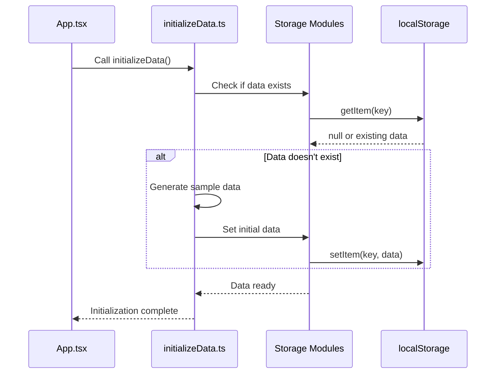

---

## Component Hierarchy

### Page Component Structure

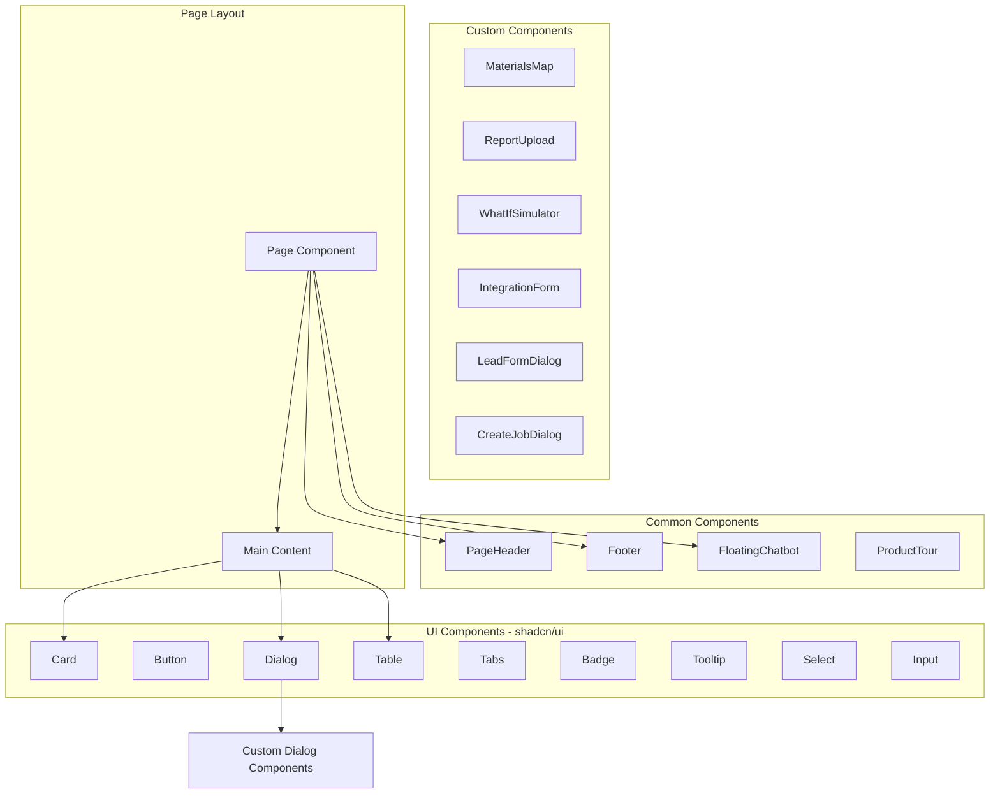

### Dashboard Component Structure

```mermaid
graph TD
    Dashboard[Dashboard.tsx]
    
    subgraph "Header Section"
        Title[Platform Title]
        AIBadge[AI Badge]
    end
    
    subgraph "Navigation Cards"
        OpsCard[Operations Center]
        MaterialsCard[Materials Hub]
        HaulersCard[Hauler Network]
        DispatchCard[Dispatches]
        SchedulerCard[Scheduler]
        ComplianceCard[Compliance]
        PermitsCard[Permits & Leads]
        JobsCard[Job Board]
    end
    
    subgraph "Shared Components"
        Tooltip[Tooltip Wrappers]
        Icons[Lucide Icons]
    end
    
    Dashboard --> Header Section
    Dashboard --> Navigation Cards
    Navigation Cards --> Tooltip
    Navigation Cards --> Icons
```

---

## Routing Structure

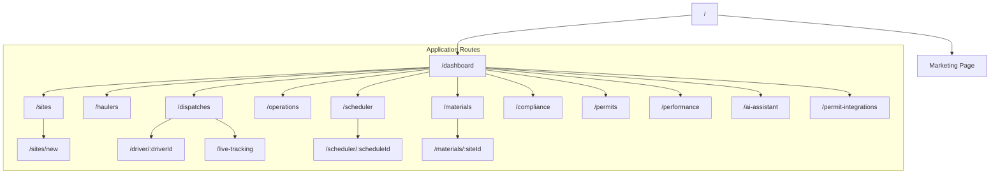

---

## AI Integration Architecture

### AI Assistant Data Flow

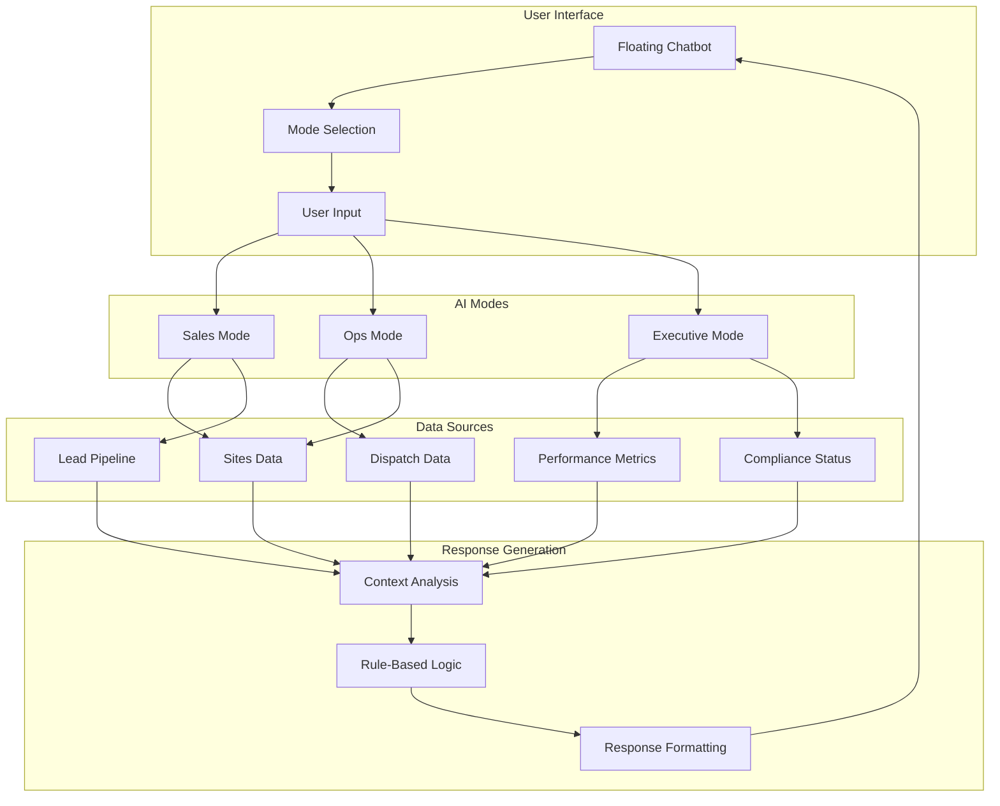

### AI-Powered Features Distribution

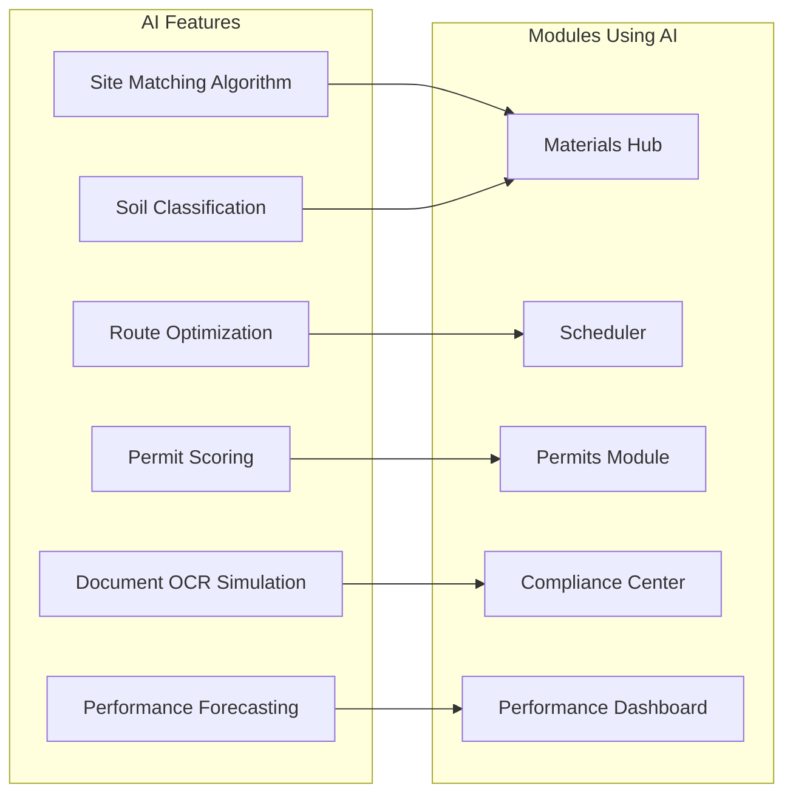

---

## Type System Architecture

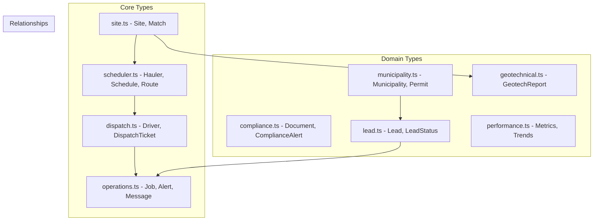

---

## Technology Stack

| Layer | Technology | Purpose |
|-------|------------|---------|
| **UI Framework** | React 18 | Component-based UI |
| **Language** | TypeScript | Type safety |
| **Build Tool** | Vite | Fast development & builds |
| **Styling** | Tailwind CSS | Utility-first CSS |
| **Components** | shadcn/ui | Pre-built accessible components |
| **Routing** | React Router v6 | Client-side routing |
| **Charts** | Recharts | Data visualization |
| **Maps** | Mapbox GL | Interactive mapping |
| **State** | React Hooks | Local state management |
| **Persistence** | localStorage | Client-side data storage |
| **Icons** | Lucide React | Icon library |
| **Animations** | Tailwind Animate | CSS animations |

---

## Design Patterns Used

### 1. **Container/Presentational Pattern**
- Pages act as containers managing state and data
- UI components handle presentation only

### 2. **Custom Hook Pattern**
- `use-toast.ts` - Toast notifications
- `use-mobile.tsx` - Responsive detection
- `use-tour.ts` - Product tour state

### 3. **Storage Abstraction Pattern**
- Each domain has dedicated storage module
- Consistent CRUD interface across all storage modules

### 4. **Initialization Pattern**
- Sample data initialized on first load
- Prevents empty state issues

### 5. **Component Composition**
- Small, focused components
- Composed into larger features

---

## Security Considerations

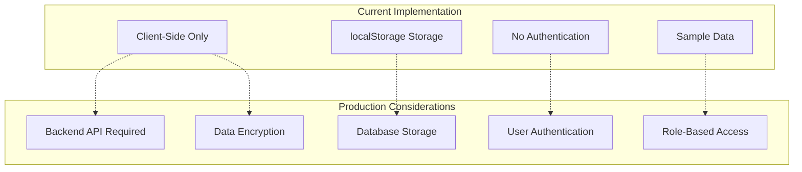

---

## Performance Optimizations

1. **Code Splitting**: React Router lazy loading capable
2. **Component Memoization**: React.memo for heavy components
3. **Efficient Re-renders**: Proper dependency arrays in useEffect
4. **localStorage Caching**: Reduces computation on repeat visits
5. **Tailwind Purging**: Only used CSS classes in production

---

*Last Updated: December 2024*
*Version: 1.0.0*
